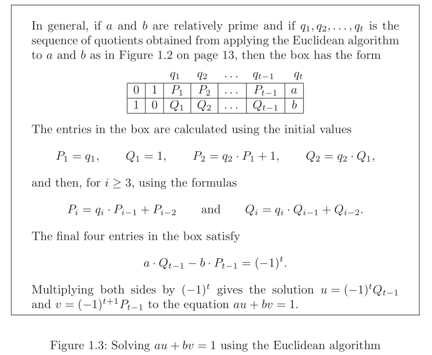
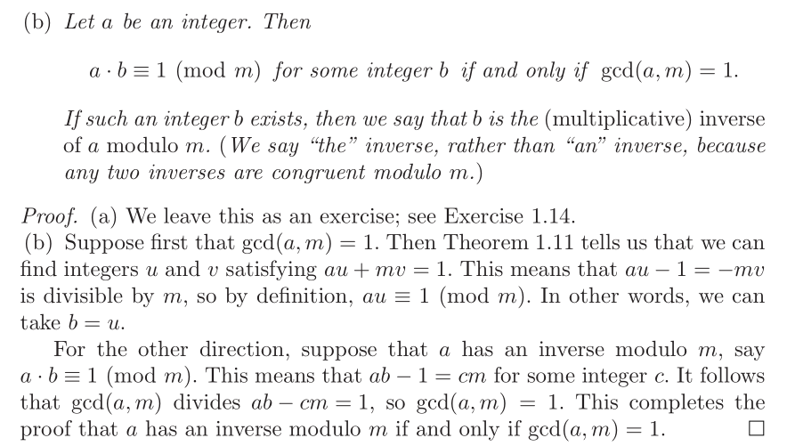
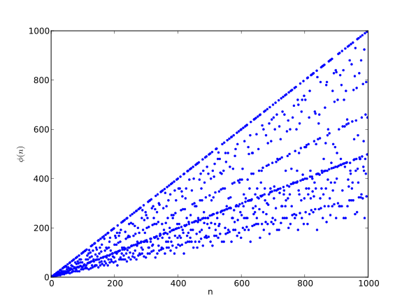
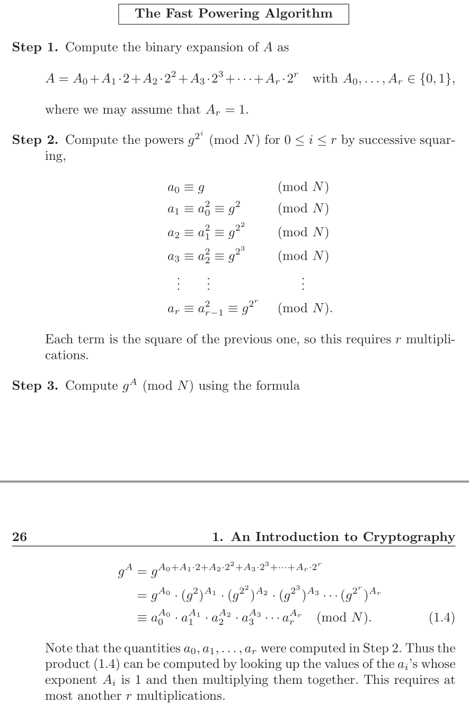
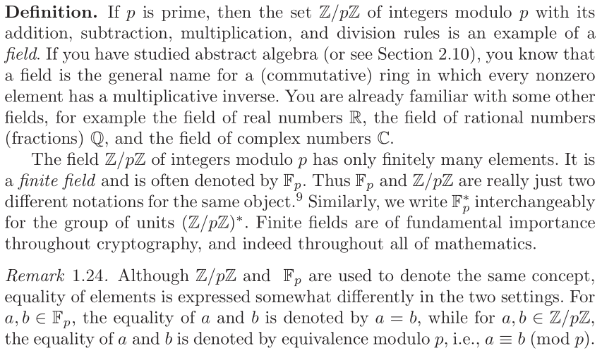
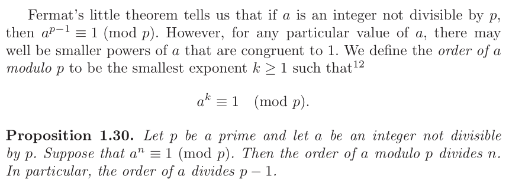
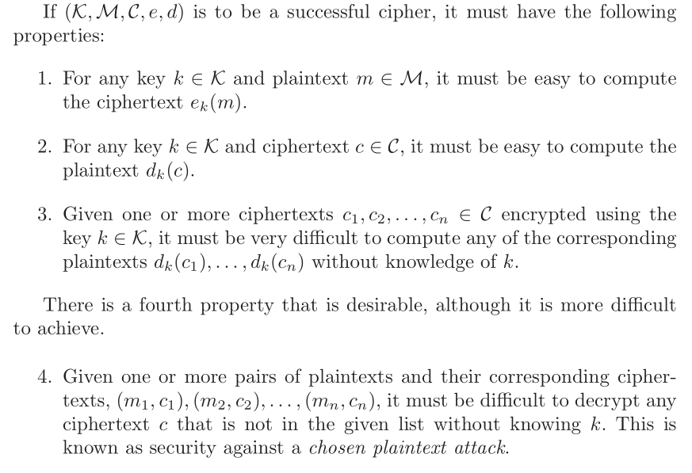

# An Introduction to Mathematical Cryptography
## Contents
- [An Introduction to Mathematical Cryptography](#an-introduction-to-mathematical-cryptography)
  - [Contents](#contents)
  - [数学基础：](#%e6%95%b0%e5%ad%a6%e5%9f%ba%e7%a1%80)
    - [总体](#%e6%80%bb%e4%bd%93)
    - [细节](#%e7%bb%86%e8%8a%82)
  - [Chapter 1 An Introduction to Cryptography](#chapter-1-an-introduction-to-cryptography)
    - [1.1 Simple substitution ciphers 简单替换密码](#11-simple-substitution-ciphers-%e7%ae%80%e5%8d%95%e6%9b%bf%e6%8d%a2%e5%af%86%e7%a0%81)
    - [1.2 Divisibility and greatest common divisors 整除与最大公约数](#12-divisibility-and-greatest-common-divisors-%e6%95%b4%e9%99%a4%e4%b8%8e%e6%9c%80%e5%a4%a7%e5%85%ac%e7%ba%a6%e6%95%b0)
    - [1.3 Modular arithmetic 模运算](#13-modular-arithmetic-%e6%a8%a1%e8%bf%90%e7%ae%97)
    - [1.4 Prime number, unique factorization, and finite fields](#14-prime-number-unique-factorization-and-finite-fields)
    - [1.5 Powers and primitive roots in finite fields](#15-powers-and-primitive-roots-in-finite-fields)
    - [1.6 Cryptography before the computer age](#16-cryptography-before-the-computer-age)
    - [1.7 Symmetric and asymmetric ciphers](#17-symmetric-and-asymmetric-ciphers)
      - [1.7.1 Symmetric ciphers](#171-symmetric-ciphers)
      - [1.7.2 Encoding schemes](#172-encoding-schemes)
      - [1.7.3 Symmetric encryption of encoded blocks](#173-symmetric-encryption-of-encoded-blocks)
      - [1.7.4 Examples of symmetric ciphers](#174-examples-of-symmetric-ciphers)
      - [1.7.5 Random bit sequences and symmetric ciphers](#175-random-bit-sequences-and-symmetric-ciphers)
      - [1.7.6 Asymmetric ciphers make a first appearance](#176-asymmetric-ciphers-make-a-first-appearance)
  - [2 Discrete Logarithms and Diffie-Hellman](#2-discrete-logarithms-and-diffie-hellman)
    - [2.1 The birth of public key cryptography](#21-the-birth-of-public-key-cryptography)
    - [2.2 The discrete logarithm problem](#22-the-discrete-logarithm-problem)


## 数学基础：
### 总体
* 数论 number theory
* 抽象代数 abstract algebra: `groups, rings, fields`
* 概率论 probability
* 信息论 information theory
* 线性代数 linear algebra
* 统计学 statistics   

高阶
* 椭圆曲线对 elliptic curve pairing
* 晶格算法 lattice-reduction algorithms


### 细节
* Congruences, primes, and finite fields
* The Chinese remainder theorem
* Euler's formula
* Primality testing
* Quadratic reciprocity
* Factorization methods
* Discrete logarithms
* Group theory
* Rings, polynomials, and quotient rings
* Combinatorics and probalility
* Information and complexity theory
* Elliptic curves
* Linear algebra
* Lattices

## Chapter 1 An Introduction to Cryptography
### 1.1 Simple substitution ciphers 简单替换密码
简单替换密码：
* Caesar cipher （shift cipher）

解空间：
26!
大于 10^26

### 1.2 Divisibility and greatest common divisors 整除与最大公约数

整除的定义：


a = bc (b != 0)

b divides a

a is divisible by b

b | a

偶数 even integers
奇数 odd integers

gcd(a, b)
最大公因数的定义:


欧几里得算法算最大公因数：


a = b · q + r 

a,b 的所有公因子与 b, r 的所有公因子相同。

互质 relatively prime

整除算法定义:


扩展欧几里得算法：
au + bv = gcd(a,b)

r2 = a - bq1      =>  
r3 = b - r2q2     =>  b = (a-bq1)q2 + r3   
r3 = -aq2 + b(q1q2+1)  
r4 = r2 - r3q3 = a(1 + q2q3) - b(q1 + q3 + q1q2q3)

归纳得出 
```
gcd(a, b) = a*w + b*v
```

73, 25

73 = 25 · 2 + 23  
25 = 23 · 1 + 2  
23 = 2 · 11 + 1  
2 = 1 · 2 + 0  




互质定义：


### 1.3 Modular arithmetic 模运算
a - b 能被 m 整除：   
a ≡ b (mod m)   

模运算定义：


Proposition 1.13. m >= 1 的整数：

a * b = 1 (mod m) 当且仅当 gcd(a, m) = 1


模运算性质：



整数模 n 的环：


group of units modulo m 的定义：


欧拉函数（Euler's phi function）的定义:




The Fast Powering Algorithm:



### 1.4 Prime number, unique factorization, and finite fields

素数的定义：


合数的质因子（算术基本定理）：


质因数指数的定义（order）：


模乘法逆：


等价于：


域的定义（field）：




### 1.5 Powers and primitive roots in finite fields
费马小定理：


order of a modulo p:



感觉等价于， a^k (mod p) 是一循环。这个循环的最小长度就叫 a 模 p 的阶

A divides B： B 除以 A 结果是整数。


primitive roots of Fp (F*p 的生成元)：


F29:
{2, 3, 8, 10, 11, 14, 15, 18, 19, 21, 26, 27}
可以看出几个特征，原根/生成元 小于 p；
素数质数都有；
个数的 %(p-1)；比如这里是%(29-1) = %(28) = 28 * (1/2) * (6/7) = 12，正好 12 个

### 1.6 Cryptography before the computer age
扯淡

### 1.7 Symmetric and asymmetric ciphers

#### 1.7.1 Symmetric ciphers




#### 1.7.2 Encoding schemes
ASCII

encoding scheme 编码方案:(eight bits)


#### 1.7.3 Symmetric encryption of encoded blocks

exhaustive search attack/brute-force attack

meet-in-the-middle

collision attacks

#### 1.7.4 Examples of symmetric ciphers

#### 1.7.5 Random bit sequences and symmetric ciphers

#### 1.7.6 Asymmetric ciphers make a first appearance

## 2 Discrete Logarithms and Diffie-Hellman

### 2.1 The birth of public key cryptography

1976

**We stand today on the brink of a revolution in cryptography.**

### 2.2 The discrete logarithm problem

离散对数问题：

