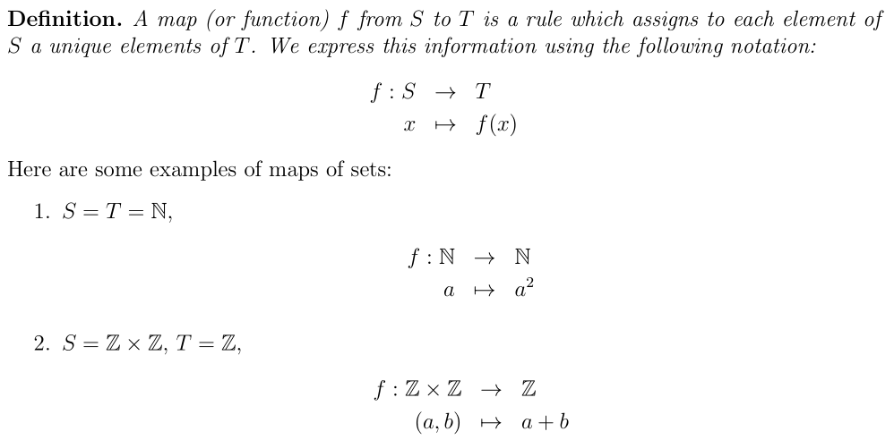
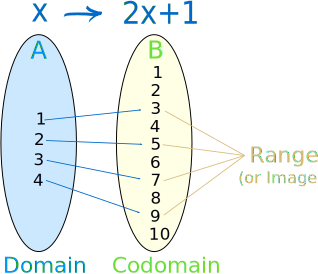

# Introduction to Abstract Algebra(Math 113)

## Contents
- [Introduction to Abstract Algebra(Math 113)](#introduction-to-abstract-algebramath-113)
  - [Contents](#contents)
  - [1. Introduction](#1-introduction)
    - [1.1 What is Algebra?](#11-what-is-algebra)
    - [1.2 Sets and Functions](#12-sets-and-functions)
    - [1.3 Equivalence Relations](#13-equivalence-relations)
  - [2. The Structure of + and x on Z](#2-the-structure-of--and-x-on-z)
    - [2.1 Basic Observations](#21-basic-observations)


## 1. Introduction
### 1.1 What is Algebra?

`Algebra is the abstract encapsulation of our intuition for composition` 

| English | 翻译 |
| :---: | :---: |
|encapsulation|封装|
|intuition|直觉|
|composition|组成，结构|

`mathematical intuitions` 数学直觉

`As we shall discover, the seemly simple idea of composition hides vast hidden depth.`

| English | 翻译 |
| :---: | :---: |
|permeate|渗透，弥漫|
|Unity|单位一|
|geometric|几何的|
|the natural numbers|自然数|
|rational|合理的|


`geometric intuition` 几何直觉

`a line` 数轴

`Addition on Z has particularly good properties` 同一个运算，在不同的结构上有不同的特性

`additive inverses` 加法逆，减法

`the rational numbers` 有理数

`the real numbers` 实数

`the complex numbers` 复数

| English | 翻译 |
| :---: | :---: |
|profound|深刻，深奥|
|vague|模糊|
|precise|精确|

`The central idea behind abstract algebra is to define a larger class of objects (sets with extra structure), of which Z and Q are definitive members.` 把运算规则也看成一种结构？(with extra structure)

```
(Z,+) → Groups
(Z,+,×) → Rings
(Q,+,×) → Fields
```
In linear algebra the analogous idea is

(R<sup>n</sup> ,+,scalar multiplication) −→ Vector Spaces over R

`The amazing thing is that these vague ideas mean something very precise and have far far more depth than one could ever imagine.`

### 1.2 Sets and Functions
`A set is any collection of objects`
| English | 翻译 |
| :---: | :---: |
|intricate|错综复杂|
|notation|符号|
|crucial|关键，临界|
|cardinality|基数|
|disjoint|集合不相交|
|compliment| 补集|
|intersection|交集|
|union|并集|
|the (cartesian) product of S and T| S和T的笛卡尔积 `{(a,b)|a属于S,b属于T}`|
|the empty set|空集|

集合的基数或大小用 |S|

```
P => Q
任意 => for all
存在 => there exists
存在! => there exists unique
element 属于 set

if S 含于 T then T \ S := {x 属于 T| x 不属于 S}。 T\S 叫做 S 在 T 中的补集。compliment
```

The union of two disjoint sets is
often written as:


`curly bracket` 大括号

`S × T = {(a,b)|a ∈ S,b ∈ T}. We call this new set the (cartesian) product of S and T. We may naturally extend this concept to finite collections of sets.` 集合的笛卡尔积




`This very simple looking abstract concept hides enormous depth. To illustrate this, observe that calculus is just the study of certain classes of functions (continuous, differentiable or integrable) from R to R.`


| English | 翻译 |
| :---: | :---: |
|enormous|巨大，庞大，极大|
|illustrate|说明，演示|
|calculus|微积分学|
|continuous|连续性|
|differentiable|可微的|
|integrable|可积的|
|domain|定义域|
|codomain|共域，陪域，值域，可能出来的值的范围|
|range|值域，范围，实际出来的值的范围|




| English | 翻译 |
| :---: | :---: |
|identity map| 恒等变换，恒等映射|
|injective | 单射、内射（函数） |
|surjective|满射|
|bijective|双射|

单射函数，嵌射函数：injection，injective function， one-to-one function。陪域里面的y，存在最多一个定义域里面的x使得f(x) = y

满射函数： surjection，onto，他的值域f(x)和陪域Y相等。


### 1.3 Equivalence Relations

| English | 翻译 |
| :---: | :---: |
|Equivalence|等价关系|
|formalized|形式化|
|symmetric property|对称属性|


1. 对称属性 symmetric property
2. 自反属性，反射属性 reflexive property
3. 传递属性 transitive property

## 2. The Structure of + and x on Z

### 2.1 Basic Observations

1. Associativity 结合律
2. Existence of additive identity 存在加法单位元
3. Existence of additive inverses 存在加法逆元
4. Commutativity 交换律


Cancellation Law 消去律：

For a,b,c ∈ Z, ca = cb and c ∕= 0 ⇒ a = b.