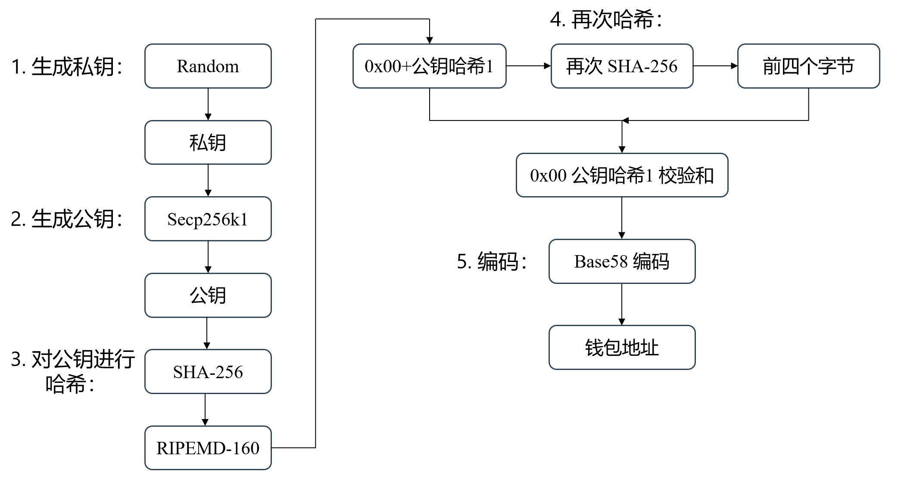
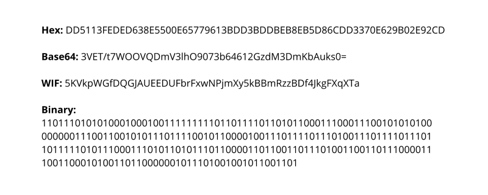

# 区块链里面的地址
人们往往忽视熟悉的事物，即使这件事是一个伟大的奇迹。而区块链就是这样一个奇迹。
想象一下目前的互联网世界，这绝对是一个鱼龙混杂的世界，里面充斥着强权，诈骗，虚假消息，垃圾信息等各种深深地勾引着人性中的恶的东西。而在一个这样的无序世界里自发涌现出来的区块链，确实如此的有序。这一切，和三十五亿年前，从混沌的海洋热汤中交汇的生化聚合物经历了漫长的地质纪年发展为有机大分子，而后产生了生机勃勃的生物圈，是如此的相似：都是从无序的混乱中，诞生了一个有序的有机系统，这是一个熵增的。真是呼应了那句话，天下万物生于有，有生于无。

而这样一个系统的基石之一，是区块链系统里面的地址系统。

## 地址前传
地址系统基于数学难题以及一个秘密。数学难题是指在公钥密码体系中，仅根据公钥很难计算出私钥（工程上基本不可能）。一个秘密就是指生成私钥的随机数。可以想象，三体人是无法直接使用 Bitcoin 系统的，因为所有三体人的脑回路是相连的，他们缺少一个秘密。关于三体人怎么使用 Bitcoin，敬请期待 *三体人会使用比特币吗*

## Bitcoin 地址生成
整体来讲，Bitcoin 的地址生成可以分为一下 5 步：

### 一、生成私钥
Bitcoin 的私钥本质是一个特殊的随机数。说它特殊，因为它要满足 Secp256k1 的私钥条件：
1. 长度是 256 bit，即 256 位二进制数；
2. 它要小于 `FFFFFFFFFFFFFFFFFFFFFFFFFFFFFFFEBAAEDCE6AF48A03BBFD25E8CD0364141`；

具体为什么要满足这两个条件，第二步会讲。

本身这个随机数是有很多表现形式的，可以通过不同的编码规则把它编码成不同的形式。

#### 什么是编码/解码
这里科普一下编码/解码(Encode/Decode)，根据[维基百科](https://zh.wikipedia.org/wiki/%E7%BC%96%E7%A0%81)：
> 编码是信息从一种形式或格式转换为另一种形式的过程；解码则是编码的逆过程。

比如，十进制的 (10)10，可以编码成二进制的 (1010)2，可以编码成八进制的 (12)8，可以编码成十六进制的 (A)16。其中 (X)y 表示在 y 进制下用 X 表示。

#### 什么是进制
这里科普一下不同[进制](https://zh.wikipedia.org/wiki/%E8%BF%9B%E4%BD%8D%E5%88%B6)下的数怎么来的。简单的说 y 进制下任何数的某一位有且仅有 y 个可能的数，然后满 y 进一。比如二进制数的某一个位只有两种可能：(0)2 或者 (1)2，如果是 (1)2 + (1)2，满 2，就得进一位，得到 (10)2。根据上述规则，可以得到不同进制的数其实是一个多项式的简略表示：

* (10)10 = **1** * 101 + **0** * 100
* (1010)2 = **1** * 23 + **0** * 22 + **1** * 21 + **0** * 20
* (12)8 = **1** * 81 + **2** * 80
* (A)16 = **A** * 160 = (10)10

而上面这三个数其实表达的数学含义是相等，都是 (10)10

这也说明了编码的一个特点：只是同一个信息的不同表现形式，不同的编码都能表示某个相同的信息，并且可以**相互转化**。这一点和哈希/加密不同，一般来说，哈希后的东西在任何情况下无法得到哈希前的东西，而加密后的东西只有在拥有对应的私钥的情况下才能得到加密前的东西。

有了进制的概念后，这样的笑话，就知道是什么意思了：`世界上有10种人：一种是懂得二进制的，另一种是不懂二进制的。`

接下来我们来看一下私钥的不同格式：

图片来源：[The same private key, written in different formats.
](https://www.freecodecamp.org/news/how-to-generate-your-very-own-bitcoin-private-key-7ad0f4936e6c/)

文字版：  
**Hex**：
`DD5113FEDED638E5500E65779613BDD3BDDBEB8EB5D86CDD3370E629B02E92CD`

**Base64**:
`3VET/t7WOOVQDmV3lhO9073b64612GzdM3DmKbAuks0=`

**WIF**:
`5KVkpWGfDQGJAUEEDUFbrFxwNPjmXy5kBBmRzzBDf4JkgFXqXTa`

**Binary**:
`1101110101010001000100111111111011011110110101100011100011100101010100000000111001100101011101111001011000010011101111011101001110111101110110111110101110001110101101011101100001101100110111010011001101110000111001100010100110110000001011101001001011001101`

> 使用[不同编码格式在线转换工具](https://cryptii.com/pipes/base64-to-hex)

上面是同一个私钥的不同表现形式，它们之间可以相互转化。我们从最底层的 **Binary** 看起，这个就是一个 256 bit 的二进制数。然后接着看一下第一行的 **Hex**，这是这个数的十六进制表示形式。这里补充一下，前面说了 y 进制下任何数的某一位有且仅有 y 个可能的数，十六进制是通过使用 0~9，再用 "(A)16，(B)16，(C)16，(D)16，(E)16，(F)16"(不区分大小写) 分别表示 "(10)10，(11)10，(12)10，(13)10，(14)10，(15)10" 来凑齐 16 个数的。而且可以看到每 4 位二进制数表示的范围是 (0000)2 ~ (1111)2，也就是 (0)10 ~ (15)10，也就是 (0)16 ~ (F)16。因此每 4 位二进制数恰好和 1 位十六进制数完全匹配。

4 位二进制与 1 位 十六进制一一对应表：
Index(十进制下的表示)|二进制下的表示|十六进制下的表示
--|:--|:--:
0|0000|0
1|0001|1
2|0010|2
3|0011|3
4|0100|4
5|0101|5
6|0110|6
7|0111|7
8|1000|8
9|1001|9
10|1010|A
11|1011|B
12|1100|C
13|1101|D
14|1110|E
15|1111|F

所以，我们可以看到私钥的二进制形式的开头四个位 (1101)2，就是表示 (13)10，也就是表示 (D)16，正好和十六进制的第一个数 (D)16 对应上了。后续的也是如此，以此类推，最后将会得到一个 `256/4 = 64` 位的十六进制数。因此，我们可以轻易实现 **Hex** (十六进制)形式与 **Binary** (二进制)形式的相互转换。

如果我们想要知道用 Base64 编码得到的私钥形式，就需要介绍一下 Base64 编码算法了。

#### 什么是 [Base64](https://en.wikipedia.org/wiki/Base64)
>[Base64](https://base64.guru/learn/what-is-base64) 是一组二进制到文本的编码方案，允许您将任何字符转换为由拉丁字母，数字，加号和斜杠组成的字母。有了它，您可以将汉字，表情符号甚至图像转换成“可读”字符串，可以将其保存或传输到任何地方。

上面的描述可能有点抽象，其实我们可以这么想：
十六进制是选取了 16 个不同的"基数"来表示每一位中不同的数字，那 Base64 就是选取了64 个不同的"基数"来表示每一位数字，因此就是某种意义上的六十四进制了。本身 Base 也有基础，基本的意思。

Base64 的一位的表示范围在 0~63，正好对应 6 位二进制数的表示范围：(000000)2 ~ (111111)2。因为 (111111)2 = **1** * 25 + **1** * 24 + **1** * 23 + **1** * 22 + **1** * 21 + **1** * 20 = (32)10 + (16)10 + (8)10 + (4)10 + (2)10 + (1)10 = (63)10

那么 Base68 选取了什么符号来分别表示 64 个不同的数呢？这些符号和数之间有什么一一对应关系？

十进制以及 6 位二进制与 1 位 Base64 格式一一对应表：
Index(十进制大小)|Base64 Character| 二进制形式 |    |Index(十进制大小)|Base64 Character|  二进制形式 | |Index(十进制大小)|Base64 Character| 二进制形式| |Index(十进制大小)|Base64 Character| 二进制形式| 
--|:--|:--|:--|:--|:--|:--|:--|:--|:--|:--|:--|:--|:--|:--:
0|  A|000000| |26|a|011010| |52|0|110100| |62|+|111110|
1|  B|000001| |27|b|011011| |53|1|110101| |63|/|111111|
2|	C|000010| |28|c|011100| |54|2|110110|
3|	D|000011| |29|d|011101| |55|3|110111|
4|	E|000100| |30|e|011110| |56|4|111000|
5|	F|000101| |31|f|011111| |57|5|111001|
6|	G|000110| |32|g|100000| |58|6|111010|
7|	H|000111| |33|h|100001| |59|7|111011|
8|	I|001000| |34|i|100010| |60|8|111100|
9|	J|001001| |35|j|100011| |61|9|111101|
10|	K|001010| |36|k|100100|
11|	L|001011| |37|l|100101|
12|	M|001100| |38|m|100110|
13|	N|001101| |39|n|100111|
14|	O|001110| |40|o|101000|
15|	P|001111| |41|p|101001|
16|	Q|010000| |42|q|101010|
17|	R|010001| |43|r|101011|
18|	S|010010| |44|s|101100|
19|	T|010011| |45|t|101101|
20|	U|010100| |46|u|101110|
21|	V|010101| |47|v|101111|
22|	W|010110| |48|w|110000|
23|	X|010111| |49|x|110001|
24|	Y|011000| |50|y|110010|
25|	Z|011001| |51|z|110011|